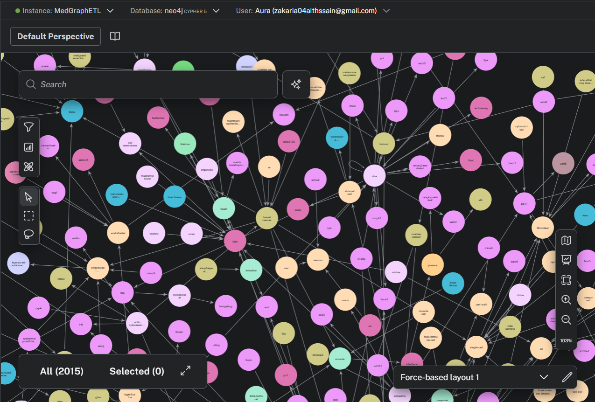
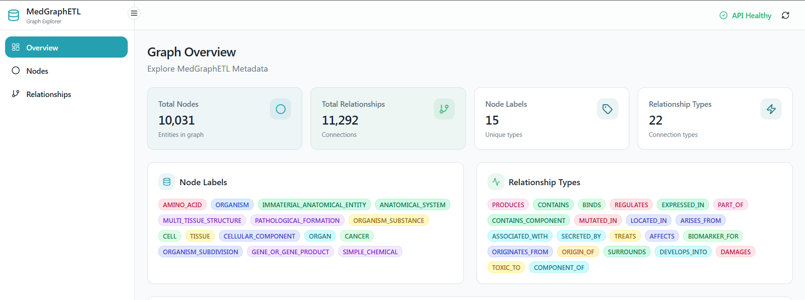
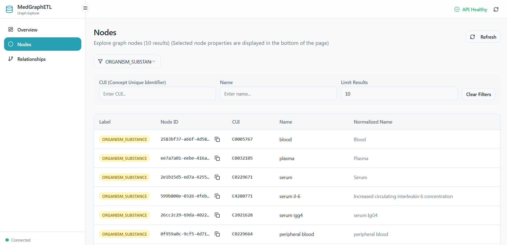
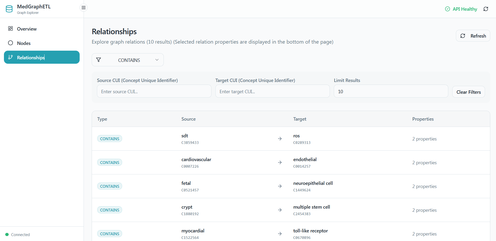

# MedGraphETL:


_“This product uses publicly available data from the U.S. National Library of Medicine (NLM), National Institutes of Health, Department of Health and Human Services; NLM is not responsible for the product and does not endorse or recommend this or any other product.”_

## Project Overview  

MedGraphETL is an end-to-end ETL pipeline that builds a biomedical knowledge graph from biomedical articles. The extracted data is transformed into a graph structure and loaded into a Neo4j instance, where it can be explored and queried. The frontend only provides a high-level exploration of the graph.


**Note:**  
This project uses **SciSpacy** for Named Entity Recognition (NER) and **spaCy matchers** for Relation Extraction (RE).  
The extracted data is **not reviewed or validated by medical professionals**.


## Architecture Overview

The system is composed of three containerized services:

- **ETL Service**: Extracts biomedical articles data from APIs and stores it in MongoDB, Transforms data via Natural Language Processing (NLP), and finally Preprocesses and Loads structured data into Neo4j.
- **API Service**: Exposes graph data through a REST API backed by Neo4j.
- **Frontend Service**: Provides a lightweight UI for high-level exploration of the graph.

**NOTE:** More technical details about each service are available in the `README` files inside each service's folder.


## Running the Project
### ETL Execution Model

The ETL service is **not started automatically** with Docker Compose.

This is a deliberate design choice:  
- The focus of the project is on the ETL pipeline and graph construction rather than the API or the frontend.
- Once built, graph exploration does not require ETL to be running
- Prevents accidental reprocessing of data

The ETL pipeline is executed independently when data ingestion or updates are required.
See `etl/README.md` for instructions on running the ETL service.

### API and Frontend Execution Model
- Run the ETL service to build the graph
- Create the `.env` file inside `api/` (See `.env.example` file inside `api/`)
- Make sure Docker and Docker Compose are installed, then run:

```bash
docker compose up --build 
```


## Detailed Main Files Structure 

```text
.
├── api/
│   ├── .env.example
│   ├── Dockerfile
│   ├── main.py
│   ├── requirements.txt
│   ├── README.md
│   ├── .dockerignore
│   └── routers/
│       ├── graph_info.py
│       ├── helpers.py
│       ├── nodes.py
│       └── relations.py
│
├── etl/
│   ├── .env.example
│   ├── Dockerfile
│   ├── main.py
│   ├── requirements.txt
│   ├── README.md
│   ├── .dockerignore
│   ├── data/
│   │   ├──ready_for_neo4j/
│   ├── config/
│   │   ├── apis_config.py
│   │   ├── log_config.py
│   │   ├── mongodb_config.py
│   │   ├── neo4jdb_config.py
│   │   ├── nlp_config.py
│   │   └── settings.py
│   ├── modules/
│   │   ├── mongo.py
│   │   ├── neo4j.py
│   │   ├── nlp.py
│   │   ├── pubmed_api.py
│   │   ├── pubmedcentral_api.py
│   │   └── umls_api.py
│   └── scripts/
│       ├── extract.py
│       ├── load.py
│       └── transform/
│           ├── annotate.py
│           └── clean.py
│
├── frontend/
│   ├── .env.local.example
│   ├── Dockerfile
│   ├── .dockerignore
│   ├── README.md
│   ├── package.json
│   ├── package-lock.json
│   ├── public/
│   └── src/
│
├── docker-compose.yml
├── .gitignore
├── LICENSE
└── README.md 
```
<p align="center">






</p>

